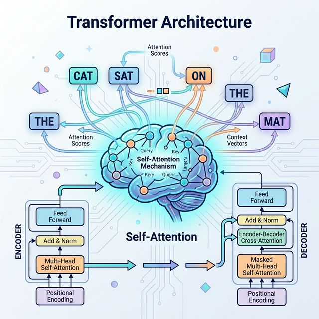

# 第四章：Transformer 架构

> 大模型的心脏，ikun 的核心技术



---

## 一句话版本

Transformer 的核心是**注意力机制**——让模型在处理每个词时，能"看到"并"关注"句子中所有其他词，自动学会哪些词之间关系更紧密。这一个发明，改变了整个 AI 领域。

---

## 为什么需要 Transformer？

回忆上一章 RNN 的两个致命问题：

```
问题 1：不能并行
  "我 是 练习 时长 两年半 的 练习生"
  RNN 必须一个字一个字处理：我→是→练习→时长→...
  7 个词 = 7 步，不能同时算

问题 2：记不住远处的信息
  "我出生在中国......所以我说的是____语"
  中间隔了 100 个词，RNN 已经忘了"中国"

Transformer 的解决方案：
  问题 1 → 所有词同时处理（并行）
  问题 2 → 每个词直接和所有其他词建立联系（注意力）
```

---

## 核心概念：注意力机制

### 生活中的注意力

```
你在教室里听课，老师说："明天考第三章"

你的注意力：
  "明天"  → ⚡ 高关注（跟我有关！什么时候？）
  "考"    → ⚡⚡ 超高关注（要考试了！）
  "第三章" → ⚡⚡⚡ 最高关注（考什么？记下来！）
  "同学们" → 💤 低关注（无关信息）
  "请"    → 💤 低关注（废话）

你不是对每个词投入一样的注意力，而是自动关注重要的词。
Transformer 做的就是这件事。
```

### 自注意力（Self-Attention）

对于句子 **"鸡 你 太 美"**，每个词都要问自己一个问题：

"**其他词里，谁跟我关系最大？**"

```
"鸡" 看 "你太美" → "太"和"美"跟我关系大（鸡你太美是固定搭配）
"你" 看 "鸡太美" → "太美"跟我关系大（你太美）
"太" 看 "鸡你美" → "美"跟我关系最大（太美）
"美" 看 "鸡你太" → "太"跟我关系最大（太美）
```

结果：每个词都带上了它最相关的上下文信息。

### QKV：注意力的三把钥匙

这是 Transformer 最核心的概念，用一个比喻：

```
想象你去图书馆找一本书：

Q（Query，查询）= 你的问题："我想找一本关于篮球的书"
K（Key，键）    = 每本书的标签："体育""烹饪""历史""篮球入门"
V（Value，值）  = 每本书的实际内容

过程：
1. 你的 Q 和每本书的 K 比较 → 算出相似度
   "篮球"和"篮球入门"→ 相似度高！
   "篮球"和"烹饪"→ 相似度低

2. 根据相似度分配注意力（softmax）
   "篮球入门" → 90% 注意力
   "体育"     → 8% 注意力
   "烹饪"     → 1% 注意力
   "历史"     → 1% 注意力

3. 用注意力权重加权汇总 V（书的内容）
   最终你获得的信息 ≈ 90% 篮球入门的内容 + 8% 体育的内容 + ...
```

在 Transformer 里：

```
每个词都会生成三个向量：Q、K、V

  词 → Q（我在找什么信息）
  词 → K（我能提供什么信息）
  词 → V（我的实际内容）

计算过程：
  注意力分数 = Q × K的转置 / √维度
  注意力权重 = softmax(注意力分数)
  输出 = 注意力权重 × V
```

### 多头注意力（Multi-Head Attention）

```
一个头只能关注一种关系。多个头能同时关注多种关系：

头1：关注语法关系（"鸡" → "美"，主语修饰）
头2：关注位置关系（"鸡" → "你"，相邻词）
头3：关注语义关系（"鸡" → "太美"，固定搭配）

就像：
  一个评委只从"唱"的角度打分
  另一个评委从"跳"的角度打分
  另一个从"rap"的角度打分
  另一个从"篮球"的角度打分
  最后综合所有评委的意见 → 全面的评价
```

在 ikun-2.5B 中：**8 个注意力头**，同时关注 8 种关系。

---

## Transformer 的完整结构

### Encoder-Decoder（原始版本）

2017 年论文提出的 Transformer 是用来做翻译的：

```
Encoder（编码器）：读懂输入句子
  "鸡你太美" → [理解后的向量表示]

Decoder（解码器）：生成输出句子
  [向量] → "Chicken you so beautiful"

中间通过"交叉注意力"连接
```

### Decoder-Only（GPT / ikun-2.5B 用的版本）

大语言模型只用了 Decoder 部分：

```
输入："鸡 你 太"
  ↓
Embedding（把词变成向量）
  ↓
位置编码（告诉模型每个词在哪个位置）
  ↓
┌─────────────── × N 层 ───────────────┐
│                                       │
│  Layer Norm                           │
│     ↓                                 │
│  自注意力（带掩码：只能看到前面的词）    │
│     ↓ + 残差连接                       │
│  Layer Norm                           │
│     ↓                                 │
│  FFN（前馈网络：两层线性变换）           │
│     ↓ + 残差连接                       │
│                                       │
└───────────────────────────────────────┘
  ↓
Layer Norm
  ↓
LM Head（预测下一个词的概率）
  ↓
输出："美" (概率最高的下一个词)
```

### 每个组件详解

**1. Embedding（嵌入层）**
```
把词变成向量（一串数字）
"鸡" → [0.2, -0.5, 0.8, 1.1, ...]  (512维向量)
"你" → [0.1, 0.3, -0.2, 0.7, ...]

为什么？因为计算机不认识汉字，只认识数字。
向量的好处：意思相近的词，向量也接近。
```

**2. 位置编码（RoPE）**
```
"鸡你太美" 和 "美太你鸡" 用了相同的词，
但意思完全不同！所以需要位置信息。

RoPE（旋转位置编码）：
  用旋转矩阵给每个位置一个独特的"印记"
  位置 1 的向量旋转一个小角度
  位置 2 的向量旋转两个小角度
  ...
  这样模型就能区分"第1个鸡"和"第4个鸡"
```

**3. 掩码（Mask）**
```
生成模型的规则：只能看前面，不能偷看后面

"鸡 你 太 美"

处理"鸡"时：只能看到 [鸡]
处理"你"时：只能看到 [鸡, 你]
处理"太"时：只能看到 [鸡, 你, 太]
处理"美"时：只能看到 [鸡, 你, 太, 美]

为什么？因为生成时是一个字一个字蹦的，
预测"太"的时候还不知道后面是什么。
```

**4. FFN（前馈网络）**
```
注意力层负责"词和词之间的关系"
FFN 层负责"每个词自身的理解和变换"

结构很简单：
  输入 → 线性层1（放大） → 激活函数 → 线性层2（缩回） → 输出

在 ikun-2.5B 中用的是 SwiGLU：
  输入 → Gate(输入) × Up(输入) → Down → 输出
  （比普通 FFN 效果更好）
```

**5. 残差连接**
```
每个子层的输出 = 子层(输入) + 输入

为什么要加？
  - 防止梯度消失（深层网络训不动的问题）
  - 保底：就算这一层没学到东西，至少信息不会丢

比喻：
  残差连接 = 保险绳
  就算你在高空失手，保险绳还能拉住你
```

**6. Layer Norm（层归一化）**
```
ikun-2.5B 用的是 RMSNorm（更快的变体）

作用：把数值统一到合理范围
就像每次练习后做拉伸，保持身体状态稳定
```

---

## Transformer 怎么生成文字？

```
以 ikun-2.5B 为例，生成"鸡你太美"：

第1步：输入 "<开始>"
  模型预测：下一个词概率分布 → "鸡"概率最高 → 选"鸡"

第2步：输入 "<开始> 鸡"
  模型预测：→ "你"概率最高 → 选"你"

第3步：输入 "<开始> 鸡 你"
  模型预测：→ "太"概率最高 → 选"太"

第4步：输入 "<开始> 鸡 你 太"
  模型预测：→ "美"概率最高 → 选"美"

第5步：输入 "<开始> 鸡 你 太 美"
  模型预测：→ "<结束>"概率最高 → 停止

这叫 "自回归生成"：每次只预测一个词，然后把它拼回去继续预测。
```

### Temperature（温度）

```
temperature = 0.1（低温）：
  "鸡"的概率 = 99% → 几乎确定选"鸡"
  输出很确定，但无聊（总是重复一样的回答）

temperature = 1.0（标准）：
  "鸡"= 60%, "我"= 20%, "你"= 15%, ...
  有一定随机性，输出更有趣

temperature = 2.0（高温）：
  "鸡"= 30%, "我"= 25%, "你"= 20%, "篮"= 15%, ...
  非常随机，可能说出奇怪的话

ikun-2.5B 默认 temperature = 0.85 → 有创意但不太疯
```

---

## ikun-2.5B 中的 Transformer

```
参数：
  隐藏维度：512
  注意力头数：8（每头 64 维）
  KV 头数：2（GQA，省显存）
  层数：8
  词表大小：6400
  位置编码：RoPE
  FFN：SwiGLU
  归一化：RMSNorm

模型结构：
  Embedding (6400 → 512)
      ↓
  8 × TransformerBlock:
      RMSNorm → GQA Attention → 残差
      RMSNorm → SwiGLU FFN    → 残差
      ↓
  RMSNorm
      ↓
  LM Head (512 → 6400) ← 和 Embedding 共享权重
      ↓
  下一个 token 的概率分布
```

---

## 本章小结

| 概念 | 一个比喻 |
|------|---------|
| 自注意力 | 每个词问"谁跟我关系最大？" |
| QKV | 查询-键-值，图书馆找书 |
| 多头注意力 | 多个评委从不同角度打分 |
| 位置编码 | 给每个词盖上"座位号"印章 |
| 掩码 | 考试不准偷看后面的题 |
| FFN | 每个词自己消化理解 |
| 残差连接 | 高空作业的保险绳 |
| 自回归生成 | 一个字一个字蹦 |
| Temperature | 控制输出的"疯狂程度" |

```
一切的起点：
  2017年，Google 发表了一篇论文
  标题只有五个词：Attention Is All You Need

  从此，Transformer 统一了 NLP
  然后统一了 CV
  然后统一了多模态
  然后统一了一切

  然后，ikun-2.5B 诞生了 🐔
```

---

[← 上一章：Diffusion 扩散模型](03-diffusion.md) | [回到目录 →](../README.md)

---

## 恭喜通关！🎉

你已经完成了 ikun-basics 的全部四章！现在你知道了：

1. **AI 的发展历程** — 从感知机到 ChatGPT
2. **CNN 和 RNN** — 看图和读文的两种方式
3. **Diffusion** — 从噪声中生成图片
4. **Transformer** — 大模型的核心架构

下一步，去 [ikun-tokenizer](https://github.com/ikun-llm/ikun-tokenizer) 开始动手实践吧！

> 理论练习完毕，练习时长 +0.5 年！距离两年半还差两年！加油！🏀
